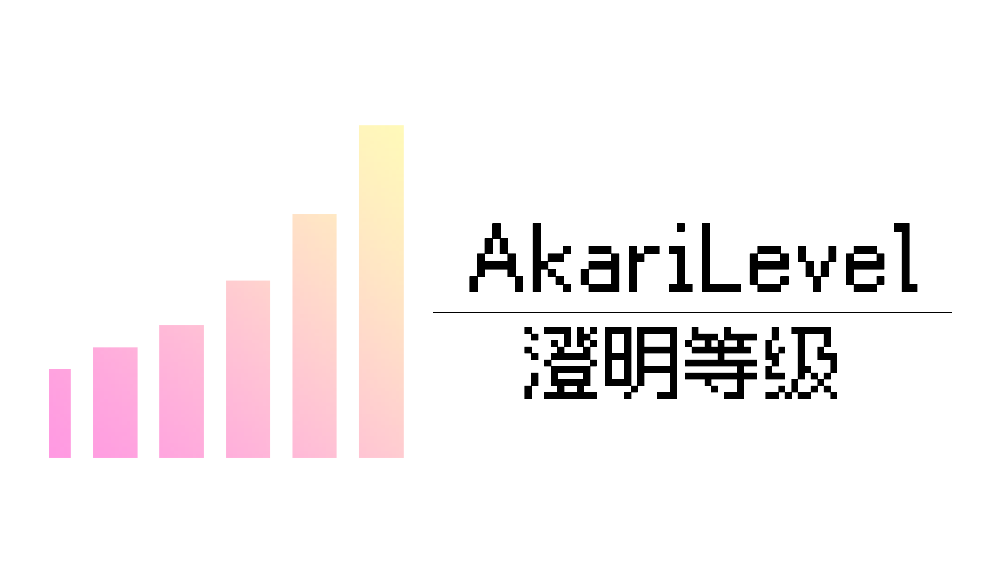

# AkariLevel

基于 TabooLib 框架开发的 Bukkit 等级插件。

## 📚 功能

- 📈 **多等级组**: 允许创建多个等级组。
- 🎮 **聊天栏编辑器**: 通过点击聊天栏文本管理等级组 / 修改玩家数据。
- 💎 **Kether**: 使用 **Kether 脚本** 设置升级动作 / 条件。
- 🏷 **变量**: 提供了丰富的 **PlaceholderAPI** 变量。
- 🗡 **经验掉落**: 兼容 **MythicMobs**，配置怪物的经验掉落。
- 📦 **数据库**: 支持 **SQLite / MySQL** 数据库。
- ⏱ **缓存机制**: 基于 **caffeine** 的数据缓存。
- 🚀 **异步处理**: 使用 **TabooLib 调度器** 异步保存数据。
- 📄 **多语言**: 允许自定义语言文件。
- 📜 **脚本**: 使用 **JavaScript** 监听事件、调用方法。
- 📌 **API**: 提供了高度自定义的接口，便于附属插件的开发。
- ...

## 🔧 命令

| 命令                                                               | 描述           |
|------------------------------------------------------------------|--------------|
| `/akarilevel help`                                               | 查看插件命令帮助     |
| `/akarilevel levelGroup`                                         | 查看等级组命令帮助    |
| `/akarilevel levelGroup info <levelGroup>`                       | 查看等级组信息      |
| `/akarilevel levelGroup list`                                    | 查看等级组列表      |
| `/akarilevel levelGroup unregister <levelGroup>`                 | 取消注册等级组      |
| `/akarilevel levelGroup reregister <levelGroup>`                 | 重新注册等级组      |
| `/akarilevel levelGroup reload`                                  | 重载配置等级组      |
| `/akarilevel member`                                             | 查看成员命令帮助     |
| `/akarilevel member has <member> <levelGroup>`                   | 检查等级组中是否存在成员 |
| `/akarilevel member add <member> <levelGroup>`                   | 为等级组增加成员     |
| `/akarilevel member remove <member> <levelGroup>`                | 从等级组移除成员     |
| `/akarilevel member info <member> <levelGroup>`                  | 查看成员信息       |
| `/akarilevel member level`                                       | 查看成员等级命令帮助   |
| `/akarilevel member level set <member> <levelGroup> <amount>`    | 设置成员等级       |
| `/akarilevel member level add <member> <levelGroup> <amount>`    | 增加成员等级       |
| `/akarilevel member level remove <member> <levelGroup> <amount>` | 移除成员等级       |
| `/akarilevel member exp`                                         | 查看成员经验命令帮助   |
| `/akarilevel member exp set <member> <levelGroup> <amount>`      | 设置成员经验       |
| `/akarilevel member exp add <member> <levelGroup> <amount>`      | 增加成员经验       |
| `/akarilevel member exp remove <member> <levelGroup> <amount>`   | 移除成员经验       |
| `/akarilevel member levelUp <levelGroup> <member>`               | 执行成员升级       |
| `/akarilevel reload`                                             | 重载插件         |

## 🔒 权限

| 权限                                  | 描述      | 默认 |
|-------------------------------------|---------|----|
| `AkariLevel.command.use`            | 命令使用权限  | OP |
| `AkariLevel.command.help.use`       | 命令帮助权限  | OP |
| `AkariLevel.command.levelGroup.use` | 等级组命令权限 | OP |
| `AkariLevel.command.member.use`     | 成员命令权限  | OP |
| `AkariLevel.command.reload.use`     | 重载命令权限  | OP |

## 🏷 变量

| 变量                                                  | 描述              |
|-----------------------------------------------------|-----------------|
| `%AkariLevel_等级组编辑名_Name%`                          | 等级组编辑名          |
| `%AkariLevel_等级组编辑名_Display%`                       | 等级组展示名          |
| `%AkariLevel_等级组编辑名_Level%`                         | 当前等级            |
| `%AkariLevel_等级组编辑名_LastLevel%`                     | 上一级             |
| `%AkariLevel_等级组编辑名_NextLevel%`                     | 下一级             |
| `%AkariLevel_等级组编辑名_MinLevel%`                      | 最小等级            |
| `%AkariLevel_等级组编辑名_MaxLevel%`                      | 最大等级            |
| `%AkariLevel_等级组编辑名_Exp%`                           | 当前经验            |
| `%AkariLevel_等级组编辑名_LevelName%`                     | 当前等级名称          |
| `%AkariLevel_等级组编辑名_LastLevelName%`                 | 上一级名称           |
| `%AkariLevel_等级组编辑名_NextLevelName%`                 | 下一级名称           |
| `%AkariLevel_等级组编辑名_LevelExp%`                      | 升级到当前等级所需经验     |
| `%AkariLevel_等级组编辑名_LastLevelExp%`                  | 升级到上一级所需经验      |
| `%AkariLevel_等级组编辑名_NextLevelExp%`                  | 升级到下一级所需经验      |
| `%AkariLevel_等级组编辑名_LevelExpFrom_旧等级%`              | 由旧等级升级到当前等级所需经验 |
| `%AkariLevel_等级组编辑名_LevelExpTo_新等级%`                | 由当前等级升级到新等级所需经验 |
| `%AkariLevel_等级组编辑名_LevelExpFromTo_旧等级_新等级%`        | 由旧等级升级到新等级所需经验  |
| `%AkariLevel_等级组编辑名_LevelProgressPercent%`          | 等级进度百分比         |
| `%AkariLevel_等级组编辑名_ExpProgressPercent%`            | 经验进度百分比         |
| `%AkariLevel_等级组编辑名_LevelProgressBar_空字符_满字符_长度%`   | 等级进度条           |
| `%AkariLevel_等级组编辑名_ExpProgressPercent_空字符_满字符_长度%` | 经验进度条           |