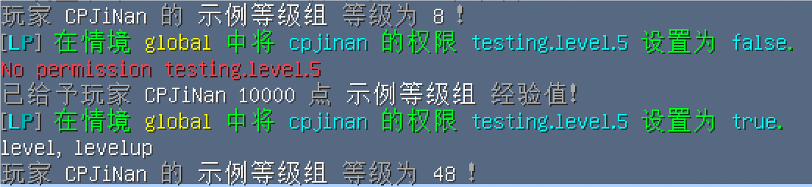

<h1 align="center">
    AkariLevel
</h1>

<p align="center" class="shields">
    
    
    
    
</p>

- en_US [English](../README.md)
- zh_CN [简体中文](../readme/README.zh_CN.md)


## 简介

这是一个**高度自定义**的 Bukkit 等级插件。

它将允许你为服务器创建多个不同的等级系统，
同时还可以设置**每个等级的名称**、**升级所需经验**、**升级条件**、以及**升级触发的奖励动作**。

为什么选择 **AkariLevel** ?

* **多等级体系支持**
* **丰富多样的 PlaceholderAPI 变量**
* **高度自定义的 Kether 脚本**
* **升级经验支持 JavaScript 脚本公式**
* **允许 DungeonPlus 组队经验共享**
* **便捷地配置 MythicMobs 经验掉落**
* **兼容 AttributePlus、SX-Attribute 等插件的经验加成属性**
* **活跃的用户社区、积极的更新维护**
* **开发者友好的 API 和 插件文档**
* ...

## 链接

- **插件文档** [https://cpjinan.github.io/Wiki/AkariLevel/](https://cpjinan.github.io/Wiki/AkariLevel/)
- **Github** [https://github.com/CPJiNan/AkariLevel](https://github.com/CPJiNan/AkariLevel)
- **MCBBS 纪念版** [https://www.mcbbs.co/thread-213-1-1.html](https://www.mcbbs.co/thread-213-1-1.html)
- **SpigotMC** [https://www.spigotmc.org/resources/116936/](https://www.spigotmc.org/resources/116936/)
- **QQ 交流群** [704109949](https://qm.qq.com/q/ZIB5KElIMq)

## 图片展示




## 命令

```
<> - 必填项 [] - 选填项

/akarilevel - 插件主命令

/akarilevel exp add <玩家名称> <等级组编辑名> <数值> [命令参数] - 给予玩家指定数值的经验
/akarilevel exp remove <玩家名称> <等级组编辑名> <数值> [命令参数] - 移除玩家指定数值的经验
/akarilevel exp set <玩家名称> <等级组编辑名> <数值> [命令参数] - 设置玩家指定数值的经验
/akarilevel exp check <玩家名称> <等级组编辑名> - 查询玩家经验

/akarilevel level add <玩家名称> <等级组编辑名> <数值> [命令参数] - 给予玩家指定数值的等级
/akarilevel level remove <玩家名称> <等级组编辑名> <数值> [命令参数] - 移除玩家指定数值的等级
/akarilevel level set <玩家名称> <等级组编辑名> <数值> [命令参数] - 设置玩家指定数值的等级
/akarilevel level check <玩家名称> <等级组编辑名> - 查询玩家等级

/akarilevel levelup [等级组编辑名] - 玩家尝试进行升级

/akarilevel trace <等级组编辑名> [命令参数] - 尝试追踪指定等级组

/akarilevel reload - 重载插件配置
```

## 权限

```
akarilevel.command.akarilevel.use - 插件命令使用权限
```

## 变量

```
%AkariLevel_等级组编辑名_Display% - 等级组展示名
%AkariLevel_等级组编辑名_MaxLevel% - 等级组最高等级

%AkariLevel_等级组编辑名_Level% - 玩家当前等级
%AkariLevel_等级组编辑名_LastLevel% - 玩家当前等级的上一个等级
%AkariLevel_等级组编辑名_NextLevel% - 玩家当前等级的下一个等级

%AkariLevel_等级组编辑名_Exp% - 玩家当前经验值

%AkariLevel_等级组编辑名_LevelName% - 玩家当前等级名称
%AkariLevel_等级组编辑名_LastLevelName% - 玩家当前等级上一个等级的名称
%AkariLevel_等级组编辑名_NextLevelName% - 玩家当前等级下一个等级的名称

%AkariLevel_等级组编辑名_LevelExp% - 升级到玩家当前等级所需经验值
%AkariLevel_等级组编辑名_LastLevelExp% - 升级到玩家当前等级的上一个等级所需经验值
%AkariLevel_等级组编辑名_NextLevelExp% - 升级到玩家当前等级的下一个等级所需经验值

%AkariLevel_等级组编辑名_ExpProgressBar% - 玩家当前经验 / 升至下一级所需经验 的进度条
%AkariLevel_等级组编辑名_LevelProgressBar% - 玩家当前等级 / 最高等级 的进度条

%AkariLevel_等级组编辑名_ExpProgressPercent% - 玩家当前经验 / 升至下一级所需经验 的进度百分比 (0 到 100 之间的整数)
%AkariLevel_等级组编辑名_LevelProgressPercent% - 玩家当前等级 / 最高等级 的进度百分比 (0 到 100 之间的整数)
```

## 经验掉落

``` yaml
示例怪物:
  Type: ZOMBIE
  Display: '示例怪物'
  Health: 5
  Damage: 0
  Drops:
  - AkariExp.Example 10 1
  - AkariExp.Example 5 0.5
  - AkariExp.Example 5~10 0.5
  Options:
    MovementSpeed: 0.1
    AlwaysShowName: true
    PreventOtherDrops: true
    MaxCombatDistance: 12
    FollowRange: 6
  Modules:
    ThreatTable: true
```

## Bstats 统计

> 该统计不会采集您的隐私信息，无需担心信息泄漏问题。


## 特别鸣谢 (排名不分先后)

Golden_Water, 2000000, liangcha385, xiaochunkun, Sting,
YangXiaoMian, Shanshui2024, InkerXoe, Zarkness, lipind,
q210520993, AlesixDev

## 友情链接

### XiaoLeBilibili

| 插件名称      | XiaoLeBilibili                         |
|-----------|----------------------------------------|
| 官方网站      | https://started.ink/aurora-plugins     |
| 插件文档      | https://docs.irepo.space/              |
| MCBBS 纪念版 | https://mcbbs2.net/thread-423-1-1.html |

### KalpaDungeon

**<font color=gray>基于 DungeonPlus 的脚本拓展插件</font>** _<font color=gray>by 晓劫</font>_

| 插件名称 | KalpaDungeon      |
|------|-------------------|
| 插件文档 | wiki.xiao-jie.top |
| QQ群  | 939244229         |

## 获取插件

### 下载

1. SpigotMC下载 https://www.spigotmc.org/resources/116936/
2. Github Releases & 自行构建 https://github.com/CPJiNan/AkariLevel
3. 加群下载 704109949

### 构建

**Windows:**

```
gradlew.bat clean build
```

**macOS/Linux:**

```
./gradlew clean build
```

构建生成的插件 jar 文件可以在项目目录下 `./build/libs` 文件夹中找到。

## 关于开发

插件为开发者提供了丰富多样的 API 接口，

您可以查阅 [插件文档](https://cpjinan.github.io/Wiki/AkariLevel/develop/api.html) 以便获取更多信息。